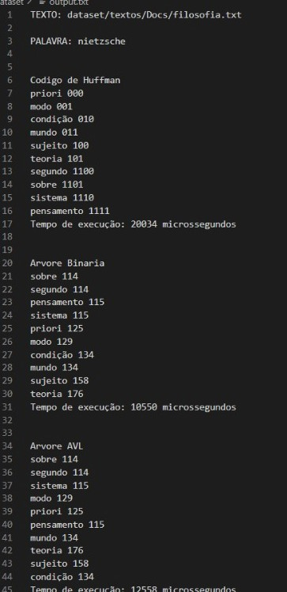

# BIN_AVL_HUFFMAN

 
 
</a> 

# Problema Proposto
  Neste trabalho, o objetivo é criar um sistema que possibilite a funcionalidade de autocompletar e oferecer sugestões de palavras aos usuários. Para atingir essa finalidade, adotaremos a estrutura da árvore binária como base. 
  
▶  Criar uma arvore binaria.  
▶ Criar uma arvore AVL.  
▶  Criar um codigo de Huffman.  
    
A partir da criacao das arvores, o objetivo e ter uma compreensão mais aprofundada das suas diferentes implementações e sua influência no sistema de autocompletar e sugestões de
palavras. A análise comparativa nos permitirá avaliar a eficácia de cada abordagem em termos de desempenho e funcionalidade.

# Arquivos
|  Arquivo                        |   Função                                                                                          |
| ------------------------------- | ------------------------------------------------------------------------------------------------- |
|  `main.cpp`                       | arquivo principal para iniciar e chamar as funções do código                                                    |
|  `read.hpp`                  | define as funções que foram utilizadas no código|
|  `read.cpp`                  | contém o escopo de todas as funções que foram utilizadas|
|  `corretor.hpp`                  | define as funções que foram utilizadas no código para determinar um padrao nas palavras lidas|
|  `corretor.cpp`                  | contém o escopo de todas as funções que foram utilizadas para determinar um padrao nas palavras lidas|
|  `Arvore.hpp`                  | define as funções que foram utilizadas no código  para a classe da Arvore de Pesquisa Binaria|
|  `Arvore.cpp`                  | contém o escopo de todas as funções que foram utilizadas para a classe da Arvore de Pesquisa Binaria|
|  `ArvoreAVL.hpp`                  | define as funções que foram utilizadas no código para a classe da ArvoreAVL|
|  `ArvoreAVL.cpp`                  | contém o escopo de todas as funções que foram utilizadas para a classe da ArvoreAVL|
|  `Huffman.hpp`                  | define as funções que foram utilizadas no código para a classe do Codigo de Huffman|
|  `Huffman.cpp`                  | contém o escopo de todas as funções que foram utilizadas para a classe do Codigo de Huffman|
|  `No.hpp`                  | define as funções que foram utilizadas no código para a classe No|
|  `No.cpp`                  | contém o escopo de todas as funções que foram utilizadas na classe No|

## HEAP
  O heap, tem uma sequencia de elementos com chaves, c[1], c[2],...,c[n], tal que, para que as chaves satisfaçam a condição de funcionamento, a chave de um nó pai deve ser maior que a chave aplicada à seus filhos. Para todo `i`, temos que:   
▶ c[i] ≥ c[2i]  
▶ c[i] ≥ c[2i + 1]  
  
Onde os filhos de `i` sao: 2i e 2i+1. Consequentemente, temps que o pai de `i` e `i` divido por 2. Essa definição deixa a estrutura similar a de uma árvore binária completa.  

O exemplo abaixo mostra, por meio de um vetor, o sistema de pai e filho do heap, demonstrado pelas setas.

  

Observe que o heap apresenta um custo de O(logN), onde N representa o numero de elementos do heap. Uma vez que este se assemelha a uma arvore binária completa, temos a relacao ao numero de nos da arvore, que tambem apresenta custo O(logN) sendo N o numero de nos. O heap apresenta custo O(1), quando houver a necessidade de acessar o elemento que ocupa o topo do vetor.

## HASH
  A tabela hash, tem uma função de transformação, essa e responsavel por receber cada elemento da entrada e gerar uma chave para esse elemento, e armazena-lo em uma dada posição da tabela, que e endereçada pela chave. Formalmente, essa função pode ser representada como h(Kj)=[1,...,M], em que o subconjunto da entrada de tamanho M é mapeada na posição Kj da tabela. Na literatura, há diversas implementações de tal função, sendo algumas dessas o resto da divisão, meio do quadrado, método da dobra, método da multiplicação, hashing universal. Se a escolha de tal função for adequada ao conjunto e houver entradas suficiente para armazenar todos os elementos sem a repetição de chaves, o custo da pesquisa cairá para O(1). O exemplo abaixo utiliza como função o resto da divisão para o conjunto de dados.Para este exemplo, considere a variável T como tamanho da tabela hash e "e" como o elemento a ser indexado.  
  
  

Observe através do exemplo que se a função utilizada for adequada e houver espaço suficiente para armazenar um único elemento por posição a estrutura em hash pode alcançar tempos de O( 1 ), o qual se refere ao melhor tempo de execução / melhor caso. Em um caso médio teremos algo próximo de O(1+N/T) e no pior caso O(n).

## BINARIA
A árvore de pesquisa é uma estrutura muito eficiênte para armazenar informações. Sua estrutura é adequada para situações quando há necessidade de considerar todos ou alguma combinação dos itens a seguir:  
▶ Acesso direto e sequencial eficiente 
▶ Facilidade de inserção e retirada de registros 
▶ Boa taxa de utilização de memória 
▶ Utilização de memória primária e secundária 

  

  -  Chamamos R de raiz da árvore, FE de filho esquerdo e FD de filho direito.  
  -  Todos os elementos menores ficam na subárvore esquerda.  
  -  Todos os elementos maiores ficam na subárvore direira.  

Diferentemente de uma arvore natural, estas sao representadas de cima para baixo, com a raiz no topo e as folhas na base(nodos terminais). A raiz e um no que nao tem ancestrais; so pode ter nos filhos. As folhas, por outro lado, nao tem filhos, ou melhor, seus filhoes sao estruturas vazias. Uma arvore pode ser definida recursivamente como:  
  -  Uma estrutura vazia, e uma arvore vazia.  
  -  Se t1,...,tk sao arvores disjuntas, entao a estrutura cuja raiz tem como suas filhas as raizes de t1,...,tk tambem e uma arvore.  
  -  Somente estruturas geradas pela regra 1 e 2 sao arvores. 

Uma arvore binaria de busca tem a seguinte propriedade: cada no n da arvore, todos os valores armazenados em sua subarvore a esquerda (a arvore cuja raiz e o filho da esquerda) sao menores que o valor v armazenado em n, e todos os valores armzenados na subarcore direita sao maiores ou igual a v. A ordenacao de maneira lexicografica tambem pode ser utilizada em casos de valores iguais.
Para uma árvore de pesquisa binária randômica, o número  esperado de comparações para encontrar um registro é de aproximadamente **1.39(lg n)**, ou seja, **39%** pior que uma árvore completamente balanceada.

## AVL

Uma arvore AVL e aquela na qual as alturas das subarvores esquerda e direita de cada no diferem no mazimo por um. Os numeros nos nos indicam os fatores de balanceamento, que sao as diferencas entre as alturas das subarvores esquerda e direita. Um fator de balanceamento e a altura da subarvore direita menos a altura da subarvore esquerda. Para uma arvore AVL, todos os fatores de balanceamento devem ser +1, 0 ou -1. Note que a definicao de arvore AVL e a mesma que a da arvore balanceada. Vale ressaltar que, a tecnica de balanceamento da arvore AVL nao garante que a arvore resultante esteja perfeitamente balanceada. Se o fator de balanceamento de qualquer no em uma arvore AVL se torna menor do que -1 ou maior que 1, a arvore tem que ser balanceada. Contudo, se os fatores de balanceamento no caminho do recem-inserido no ate a raiz da arvore sao todos zero, tem que ser atualizados, mas nenhuma rotacao e necessaria para quaisquer nos encontrados. A busca de pior caso exige **O(lg n)** comparacoes. Para uma arvore binaria perfeitamente balanceada de mesma altura h e **lg(h+1)**. Por esta razao, o tempo de busca no pior caso em uma arvore AVL e **44%** pior do que na configuracao de arvore do melhor caso.

## HUFFMAN

A codificação de Huffman é um algoritmo cujo princípio básico está na geração de uma codificação de prefixo para tratar a frequência de cada símbolo de uma entrada. Seu objetivo é gerar o menor número de bits possível para a representação de cada uma das frequências mapeadas. O filho esquerdo esta associado ao bit ZERO enquanto o filho direito esta associado ao bit UM. A ideia do algoritmo de Huffman começa com um conjunto de N folhas e, em seguida, realiza N - 1 operações sequenciais de combinação de dois vértices da árvore. Em cada uma dessas combinações, um novo vértice interno é criado, que se torna o pai dos vértices que estão sendo combinados. A escolha de quais dois vértices combinar em cada passo depende da soma das frequências das folhas das subárvores com raízes nos vértices que ainda não foram combinados.

▶A:0.08, B:0.10, C:0.12, D:015, E:0.20 e F:0.35 como suas respectivas frequências.

  

Se T e a  arvore que representa a codificacao, dT (c) e a profundidade da folha representado o caracter c e f(c) e a sua frequencia, o tamanho do arquivo comprimido ser a dado por:

  

Dizemos que B(T) e o custo da arvore T. Isto e exatamente o tamanho do arquivo codificado.

# Lógica
Diante da logica feita no problema Top-K-Items ja resolvido, foi feita a adicao da logica para a criacao das arvores, binaria, avl e huffman. Para a resolucao do problema foram desenvolvidas classes para cada arvore, e o No que determina a palavra, a quantidade de ocorrencias e no caso da AVL o fator de balanceamento. Na funcao 'fn+principal()' ocorre a maior parte do programa, nela, sao criados todos os filenames para os arquivos a serem utilizados, tambem sao criadas os unordered_map e vector necessarios, em seguida e realizado um loop que funciona com o objetivo de alterar os filenames para que seja possivel ler todos e fazer a verificacao. Dentro desse loop, ocorre outro loop que tem como objetivo funcionar enquando houver palavras no words(), unordered_map que apresenta as palavras a serem verificadas, entao ocorre a leitura do texto que esta sendo analizado e todos os dados necessarios sao salvos na hash para que o heap seja feito depois, dentro da funcao de 'leitura_principal' a variavel existeNoTexto e considera true no caso de que a palavra lida do words() esteja naquele texto, e se estiver deve fazer o processo de criacao das arvores em cima da palavra, lembrando que esta nao pode aparecer em nenhuma das arvores. Desse modo, temos que em cada texto e verificado se cada palavra do words aparece, em caso de aparicao e criado as arvores em cima do texto que esta sendo lindo, sucessivamente feito para os outros textos. O processo de criacao das arvores passa pela funcao 'heap()', nela e feito o desenvovimento da heap com as 20 palavras que tem maior frequencia, apos a construcao do heap ele e passado como parametro para a criacao das arvores.

Arvore Binaria: Para o desenvovimento da arvore binaria temos a funcao 'inserirAux()' que e um usada para inserir um nó (um elemento da árvore) na árvore binária. Ele começa comparando a quantidade dada com a quantidade do nó atual para determinar se o novo nó deve ser inserido à esquerda ou à direita do nó atual, caso as palavras apresentem a mesma quantidade, e feita uma analise da ordem alfabetica. A inserção é feita de forma recursiva, chamando o mesmo método para o filho esquerdo ou direito, dependendo da comparação. A funcao 'inserir()' é usada para inserir um conjunto de nós (representados como um vetor heap) na árvore binária. Ele percorre o vetor de nós e, para cada nó, chama o método inserirAux para inserir o nó na árvore. A árvore é construída à medida que os nós são inseridos.  Após inserir todos os nos, a funcao Imprimir e chamada para que seja possivel ter uma visualizacao da arvore.

Arvore AVL: Para o desenvolvimento da arvore AVL temos a funcao altura esta calcula a altura de um nó na árvore AVL. A altura é a maior distância entre o nó atual e um de seus nós folha mais distantes, ela é implementada de forma recursiva. A funcao calcularbalanceador calcula o fator de balanceamento de um nó. O fator de balanceamento de um nó é a diferença entre as alturas das subárvores esquerda e direita desse nó. Um fator de balanceamento maior que 1 indica que a árvore está desbalanceada à esquerda, e um fator de balanceamento menor que -1 indica que a árvore está desbalanceada à direita. A funcao rotacaoDireita() é usada para realizar uma rotação à direita em um nó y desbalanceado ajustando os ponteiros para reequilibrar a árvore. A funcao rotacaoEsquerda() é usada para realizar uma rotação à esquerda em um nó x desbalanceado, ajustando os ponteiros para reequilibrar a árvore. A funcao inserirAux() esta é usado para inserir um nó na árvore AVL de maneira recursiva, insere o nó da mesma forma que uma árvore de busca binária, mas também verifica e reequilibra a árvore quando necessário com base no fator de balanceamento dos nós. A funcao inserir() insere um conjunto de nós (representados como um vetor heap) na árvore AVL. Ele percorre o vetor de nós e, para cada nó, chama o método inserirAux para inserir o nó na árvore. Após inserir todos os nos, e chamada a funcao Imprirmir para que seja possivel ter uma visualizacao da arvore.

Codigo de Huffman: A funcao generateHuffman() é responsável por gerar a árvore de Huffman a partir de uma fila de prioridade (priority_queue) de objetos Huffman. A ideia central é juntar repetidamente os dois nós com menor frequência para criar uma árvore binária até que reste apenas um único nó, que será a raiz da árvore de Huffman. A funcao imprimirCodes() é usada para percorrer a árvore e imprimir os códigos binários associados a cada palavra. Ele começa na raiz da árvore e percorre-a recursivamente, seguindo os caminhos esquerdo e direito. Quando ele alcança uma folha (um nó que não tem filhos esquerdo e direito), imprime a palavra e seu código binário associado. A funcao HuffmanCodes() é usada para criar códigos de Huffman a partir de um vetor de No, ela cria objetos Huffman para cada nó no vetor e os coloca em uma fila de prioridade. Em seguida, chama generateHuffman para criar a árvore de Huffman e, em seguida, chama imprimirCodes para imprimir os códigos.

Apos a criacao e print de todas as arvores no output.txt, e possivel fazer analises referentes ao uso e funcionamento dessas estruturas.

 # Resultados 
   Considerando a lógica e a descrição do problema acima, o resultado esperado diante a leitura dos arquivos:
   
 

   
   

   Pode-se ver que o output.txt apresenta o texto que esta sendo analisado e em seguida a palavra a ser analisada, esse processo e feito para todas as palavras lidas no input.data para todos os textos, em seguida, mostra-se a arvore feita a partir da palavra mostrada, codigo de huffman, arvore binaria e a arvore AVL. Caso a palavra nao tenha nenhuma aparicao no texto, e colocada uma mensagem avisando isso, como acontece na palavra aquilo, no exemplo acima. 

# Conclusao
  Por meio do projeto e possivel compreender melhor o funcionamento das arvores Binaria, AVL e Huffman, sendo estruturas fundamentais, que podem ser utilizadas para resolver diversos problemas. Neste caso, para a solucao do problema Sistema de Autocompletar e Sugestões de Palavras, e possivel pegar as palavras com maior frequencia de apariacao e mostrar outras que podem ser utilizadas em sequencia a partir da frequencia. Todas as arvores montadas conseguem cumprir o proposito, e retornam as palavras conforme a frequencia. Para caso de analise, em cada situacao pode ser necessario utilizar uma arvore diferente, caso queira apenas analisar o dados de maneira ordenada e uma busca eficiente, a arvore Binaria e uma boa opcao, caso queira garantir o balanceamento dos dados na arvore utilizar do sistema da AVL, e caso queira comprimir os dados utilizar o codigo de Huffman, alem de tambem representar eficientemente os dados com frequencias diferentes.
 # Bibliotecas 

Para o funcionamento do programa, é necessário incluir as seguintes bibliotecas: 
<ul>
    <li><code>#include 'bits/stdc++.h'</code></li>
    <li><code>#include 'algorithm'</code></li>
    <li><code>#include 'vector'</code></li>
    <li><code>#include 'cctype'</code></li>
    <li><code>#include 'iomanip'</code></li>
    <li><code>#include 'iostream'</code></li>
</ul>

# Compilação e Execução

Esse pequeno exemplo possui um arquivo Makefile que realiza todo o procedimento de compilação e execução. Para tanto, temos as seguintes diretrizes de execução:

| Comando                |  Função                                                                                           |                     
| -----------------------| ------------------------------------------------------------------------------------------------- |
|  `make clean`          | Apaga a última compilação realizada contida na pasta build                                        |
|  `make`                | Executa a compilação do programa utilizando o g++, e o resultado vai para a pasta build           |
|  `make run`            | Executa o programa da pasta build após a realização da compilação                                 |

# Contatos

 

